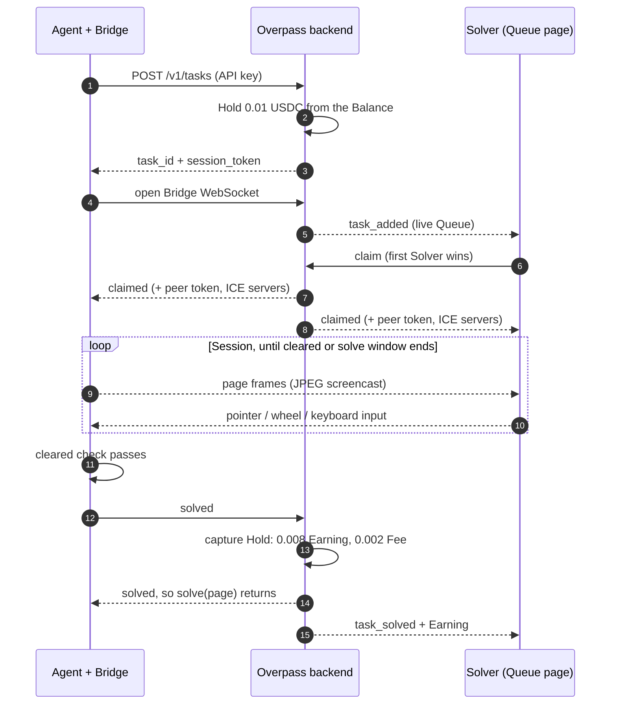
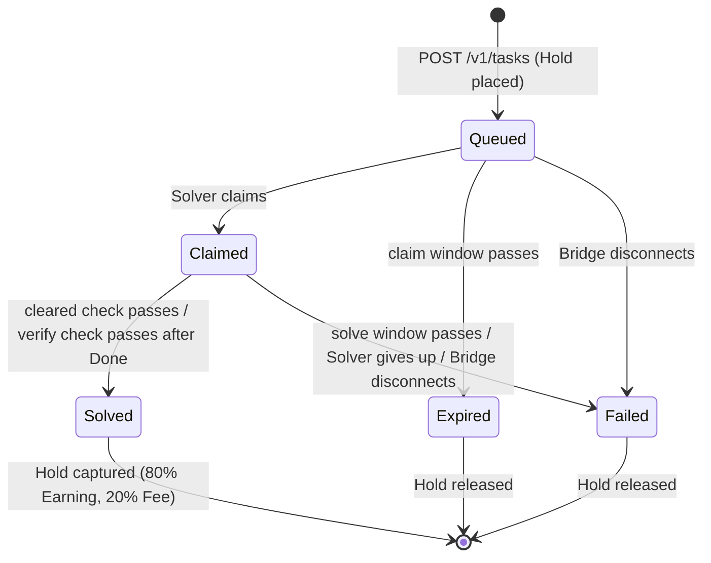
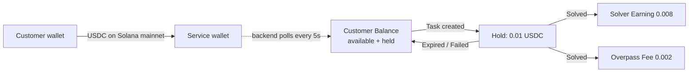
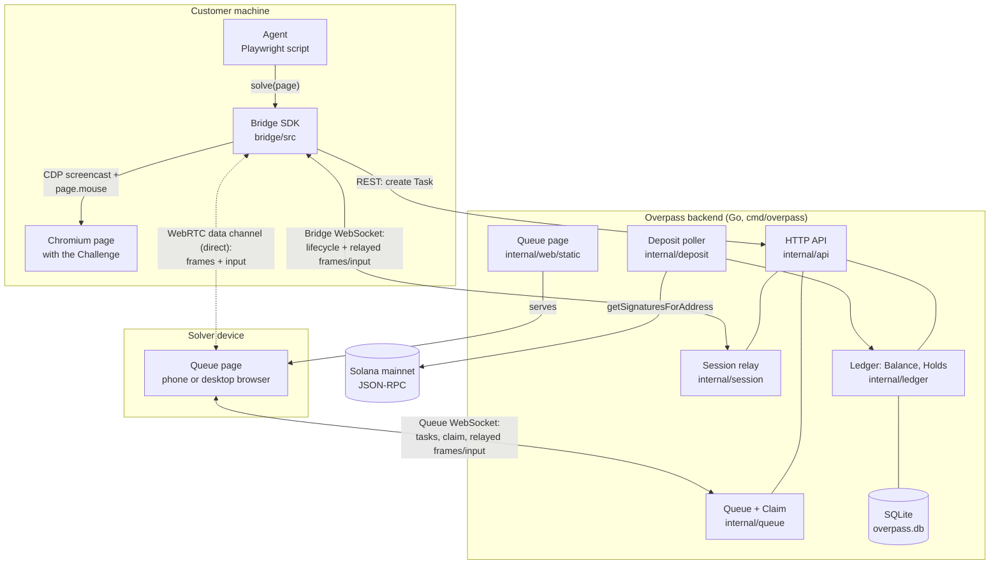
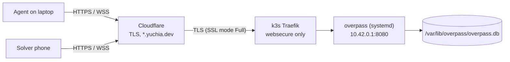

# Overpass

**A human unblocks your AI Agent when its browser gets stuck.**

An Agent's browser hits a Challenge it cannot pass, such as a reCAPTCHA or a
slider puzzle. The Agent calls `solve(page)`. A human Solver claims the job
on the Queue page, controls the Agent's browser remotely from a phone or
desktop, and clears the Challenge. The Agent then carries on. The Customer
pays 0.01 USDC per solved Task from a prepaid Balance on Solana.

```ts
import { solve } from "@overpass/bridge";

await page.goto("https://example.com/login");
await solve(page); // returns once a human has cleared the Challenge
await page.click("#submit");
```

Terms like Task, Hold and Session have exact meanings here. See
[CONTEXT.md](CONTEXT.md) for the glossary.

## Contents

- [How it works](#how-it-works)
- [System architecture](#system-architecture)
- [Repository layout](#repository-layout)
- [Run the demo locally](#run-the-demo-locally)
- [Run the demo against the public backend](#run-the-demo-against-the-public-backend)
- [Configuration](#configuration)
- [Troubleshooting](#troubleshooting)
- [Tests](#tests)

## How it works

### The three people involved

| Who          | What they do                                                    | How they talk to Overpass                   |
| ------------ | --------------------------------------------------------------- | ------------------------------------------- |
| **Customer** | Owns the Agent. Registers a Solana wallet and prepays USDC.     | API key (`op_...`)                          |
| **Agent**    | The Customer's Playwright program. Embeds the Bridge SDK.       | `solve(page)` from the Bridge SDK           |
| **Solver**   | A human who clears Challenges and earns USDC.                   | Queue page in a browser, identified by wallet |

### One Task, start to finish



In words:

1. **Create.** The Agent calls `solve(page)`. The Bridge creates a Task, and
   the backend puts a Hold of one Price on the Customer's Balance. If the
   available Balance is too low, the backend returns 402 and the Bridge
   throws `InsufficientBalanceError`.
2. **Queue.** Every connected Solver sees the Task appear live.
3. **Claim.** The first Solver to tap **Claim** gets it. A Task is claimed at
   most once and is never requeued.
4. **Session.** The Bridge streams the page to the Solver with a CDP
   screencast. The Solver taps, drags, scrolls and types. The Bridge replays
   that input through Playwright's mouse and keyboard APIs, so the page sees
   trusted events and never synthetic DOM events. Typing allows text and a
   short list of named keys (Enter, Backspace, Tab, arrows...), never
   Ctrl/Cmd shortcuts.
5. **Solved.** The Bridge polls the Agent's cleared check every 500 ms (by
   default, "reCAPTCHA has issued a token"). The Solver can also tap
   **Done**: the Agent takes the page back and runs its verify check (the
   cleared check unless it passes its own). If the Challenge is still there,
   the Solver is told so and keeps the page. Once either check passes, the
   Agent has the page for good, the Bridge reports Solved, the Hold is
   captured and `solve(page)` returns.

### How a Task can end

Every Task ends in exactly one of three outcomes. The first one recorded
wins.



| Outcome     | Bridge throws         | Money                        |
| ----------- | --------------------- | ---------------------------- |
| **Solved**  | nothing, it returns   | Hold captured                |
| **Expired** | `TaskExpiredError`    | Hold released to the Customer |
| **Failed**  | `TaskFailedError`     | Hold released to the Customer |

### Money flow



- **Deposit.** The Customer sends USDC from their registered wallet to the
  service wallet. The backend watches the service wallet's USDC token account
  and credits the sender's Balance. Deposits are deduplicated by transaction
  signature.
- **Unattributed Deposit.** USDC from a wallet nobody has registered is kept
  and credited once that wallet registers.
- **Registration.** The Customer proves wallet ownership by signing a
  single-use challenge (ed25519). Registering again issues a new API key and
  revokes the old one.
- Solver payouts are manual for now. The backend records each Earning
  against the Solver's wallet.

## System architecture



### Components

| Component          | Where                            | Job                                                                                   |
| ------------------ | -------------------------------- | ------------------------------------------------------------------------------------- |
| **Bridge SDK**     | [bridge/src/](bridge/src/)       | `solve(page)`: creates the Task, streams frames, replays input, runs the cleared check. |
| **HTTP API**       | [internal/api/](internal/api/)   | REST endpoints plus the Bridge and Queue WebSockets.                                   |
| **Queue**          | [internal/queue/](internal/queue/) | Live list of unclaimed Tasks. First Claim wins, one Claim per Solver at a time.       |
| **Session**        | [internal/session/](internal/session/) | Pairs one Bridge with its Solver. Relays frames and input, and keeps the Session alive across a Solver reconnect. |
| **Ledger**         | [internal/ledger/](internal/ledger/) | Balances, Holds, capture and release.                                               |
| **Deposit poller** | [internal/deposit/](internal/deposit/) | Polls Solana for USDC sent to the service wallet and credits Balances.          |
| **Queue page**     | [internal/web/static/](internal/web/static/) | Solver UI: connect a wallet, claim, see the page, send taps and drags.     |
| **Register CLI**   | [cmd/overpass-register/](cmd/overpass-register/) | Signs the registration challenge with a Solana keypair file and prints the API key. |

### Two ways frames travel

Frames and input use one of two paths during a Session:

1. **Direct (WebRTC), preferred.** At Claim the backend gives both sides a
   per-Session peer token and STUN/TURN servers. The Solver's page sends an
   offer through the backend, the Bridge answers, and a WebRTC data channel
   opens between them. The Solver must present the peer token before the
   Bridge sends anything. Frames go as chunked binary JPEG. The backend is out
   of the data path.
2. **Relayed (WebSocket), fallback.** If WebRTC is unavailable, blocked, or
   drops, frames and input go through the backend's two WebSockets.

The Bridge WebSocket stays open either way and carries the Task lifecycle
(claimed, solved, expired, failed). A direct connection exposes each side's IP
address to the other. Solvers can opt out on the Queue page, and Agents can
pass `solve(page, { p2p: false })`. WebRTC in the Bridge comes from
[werift](https://github.com/shinyoshiaki/werift-webrtc), an optional
dependency. Without it, Sessions stay relayed.

### HTTP API

| Method + path                    | Auth        | Purpose                                     |
| -------------------------------- | ----------- | ------------------------------------------- |
| `POST /v1/customers/challenge`   | none        | Get a registration challenge to sign        |
| `POST /v1/customers`             | signature   | Register a wallet and get an API key         |
| `GET /v1/balance`                | API key     | Available and held Balance                   |
| `POST /v1/tasks`                 | API key     | Create a Task (402 if Balance is too low)    |
| `GET /v1/tasks/{id}/bridge`      | session token | Bridge WebSocket                           |
| `GET /v1/queue?wallet=...`       | none        | Solver Queue WebSocket                       |
| `POST /v1/dev/credit`            | API key     | Free credit, only with `-dev`                |
| `GET /`                          | none        | Queue page                                   |

Amounts are USDC base units: 1 USDC = 1,000,000.

## Repository layout

```
cmd/overpass/            Go backend entry point
cmd/overpass-register/   CLI that registers a Customer with a keypair file
internal/                Backend packages (api, queue, session, ledger, deposit, ...)
internal/web/static/     Queue page (plain HTML + JS)
bridge/src/              Bridge SDK (TypeScript)
bridge/demo/             Demo Agents: fake Challenge, real reCAPTCHA, Stagehand, Jev
bridge/test/             Bridge tests
deploy/                  systemd unit, k3s Ingress, deploy script
CONTEXT.md               Glossary
```

## Run the demo locally

The Solver uses a phone through an ngrok tunnel. You need three terminals.
Run every command from the repo root unless the step says otherwise.

### Prerequisites

- Go 1.26+ and Node 22+
- [pay.sh CLI](https://pay.sh) with a funded **local** account. A
  remote-custody account will not work, because the keypair must be
  exportable.
- ngrok with an authtoken (`ngrok config add-authtoken <token>`)
- Bridge dependencies:

  ```sh
  cd bridge && npm ci && npx playwright install chromium
  ```

### 1. Start the backend (terminal 1)

If an old server is still on port 8080, stop it first:

```sh
lsof -ti tcp:8080 | xargs kill
```

Then start the backend in one of two modes.

**With real USDC Deposits.** The backend polls Solana mainnet every 5s:

```sh
go run ./cmd/overpass -claim-window 30s -solve-window 60s
```

**Without real USDC.** Deposit polling is off and free dev credit is on:

```sh
go run ./cmd/overpass -claim-window 30s -solve-window 60s -dev -rpc-url ""
```

State lives in `overpass.db` in the current directory (change it with
`-db path`). Reuse the same file and your registration and Balance carry
over.

### 2. Register the Customer (once per database)

The pay CLI cannot sign messages, so export the keypair and let
`overpass-register` sign the challenge:

```sh
pay account export local                      # writes ./pay-account-local-<pubkey>.json
go run ./cmd/overpass-register -keypair ./pay-account-local-*.json
rm ./pay-account-local-*.json                  # it holds the private key
```

It prints the API key once. Export it in every terminal that runs an Agent:

```sh
export OVERPASS_API_KEY=op_...
```

### 3. Fund the Balance

**Real Deposit.** Send USDC from the registered wallet to the service
wallet. The backend sees it about 5s after confirmation:

```sh
pay send 0.05 CW82aTEMcqsqwLaxppzrpEnM41bC83R8JUXpZgYcrhGt --account local
```

pay adds a small network fee on top. Pass `--fee-within` to take it out of
the amount instead.

**Dev credit.** Works only when the backend runs with `-dev`:

```sh
curl -X POST -H "Authorization: Bearer $OVERPASS_API_KEY" \
  -d '{"amount":100000}' http://localhost:8080/v1/dev/credit
```

Check the Balance:

```sh
curl -H "Authorization: Bearer $OVERPASS_API_KEY" http://localhost:8080/v1/balance
```

### 4. Open the tunnel (terminal 2)

```sh
ngrok http 8080
```

Copy the `https://….ngrok-free.dev` URL. On the phone:

1. Open the URL.
2. ngrok's free tier shows a warning page the first time. Tap **Visit Site**.
3. Enter the Solver's Solana wallet address and tap **Connect**. The status
   line should read "Connected as …".

The phone can be on cellular. Only the phone uses the tunnel; the Agent
talks to `http://localhost:8080`.

### 5. Run an Agent (terminal 3)

```sh
cd bridge
npm run demo              # local fake Challenge: button click or slider drag
npm run demo:recaptcha    # Google's reCAPTCHA demo page
```

A Chromium window opens and the Agent creates a Task. On the phone:

1. The Task appears in the Queue. Tap **Claim** within 30s.
2. The Agent's page appears, with its URL and a countdown.
3. Clear the Challenge: tap, drag the slider, or scroll with a mouse wheel on
   desktop. To type, tap a field on the Agent's page, then use the
   "Tap here to type" box (on a computer, just type). If the Task did not
   finish by itself, tap **Done** and the Agent checks the page.
4. The phone shows "Solved! Earning of 0.008 USDC recorded." and the Agent
   continues.

If the phone's connection drops, reopen the URL and connect with the same
wallet before the solve window ends. The Session resumes.

Options:

- No browser window: `HEADLESS=1 npm run demo`
- Another backend: `OVERPASS_URL=https://… npm run demo`

### A fast browser agent: Jev Ultrafast

`npm run demo:jev` runs [Jev Ultrafast](https://github.com/browser-use/jev-ultrafast),
a Python browser agent from Browser Use, on Indiana's business search (INBiz).
Jev works on its own, the reCAPTCHA included: the demo shows it the controls
inside frames, which Jev does not read by itself. Jev also gets a
`HIRE_HUMAN` operation, offered after three attempts at an obstacle, and
decides itself whether to use it. It then describes the obstacle in one
sentence, the Solver's whole job, and its tab goes to a Solver.

The Task is Solved when the CAPTCHA issues a new token, or when the Solver
taps Done and Jev, looking at the page, agrees the obstacle is gone.
Otherwise the Solver keeps the page until the solve window ends. Either way
Jev then carries on. When Jev is blocked, it looks again with `HIRE_HUMAN`
on offer, at most twice a run. `JEV_TRACE=file.json` saves Jev's decisions.

Needs [uv](https://docs.astral.sh/uv/), a TypeSafe key
(console.typesafe.ai/keys) and a Gemini API key for typing into fields:

```sh
cd bridge
TYPESAFE_API_KEY=… GEMINI_API_KEY=… OVERPASS_API_KEY=… npm run demo:jev
```

The first run launches a separate Chrome with its own profile in
`~/.overpass/jev-chrome` and a debugging port on 9335. Leave it open between
runs. Your everyday Chrome would ask "Allow remote debugging?" each time the
Bridge connects. Set `AGENT_URL` and `AGENT_TASK` for another site.

The page fills the Chrome window, and resizing the window lays it out again.
`JEV_VIEWPORT` sets its starting size (default `800x900`). The Solver sees the
same page, so `480x720` gives a Solver on a phone bigger image tiles to tap.

## Run the demo against the public backend

The backend runs at `https://overpass.yuchia.dev` on the `hubstream` EC2
instance. The Agent stays on the laptop; the Solver uses a phone or iPad over
the internet.



### 1. Deploy

```sh
deploy/deploy.sh hubstream
```

This cross-compiles `cmd/overpass` for the instance, installs the binary and
systemd unit, restarts the service and applies the Ingress. The database is
kept. Follow logs with `ssh hubstream journalctl -u overpass -f`.

### 2. Register the Customer (once per database)

```sh
pay account export local
go run ./cmd/overpass-register -server https://overpass.yuchia.dev -keypair ./pay-account-local-*.json
rm ./pay-account-local-*.json
export OVERPASS_API_KEY=op_...
```

The instance has its own database. On registration it credits every earlier
Deposit from that wallet, even ones already spent against a local database.

### 3. Fund and check the Balance

Make a real Deposit as in [local step 3](#3-fund-the-balance), then:

```sh
curl -H "Authorization: Bearer $OVERPASS_API_KEY" https://overpass.yuchia.dev/v1/balance
```

### 4. Run the Agent and solve

```sh
cd bridge
OVERPASS_URL=https://overpass.yuchia.dev npm run demo:recaptcha
```

Open `https://overpass.yuchia.dev` on the phone, connect with the Solver's
wallet, and Claim within 30s. The public backend gives the Solver 5 minutes
to clear the Challenge.

### Deployment notes

- **Cloudflare SSL mode must be Full**, not Flexible or Full (strict).
  Cloudflare connects to Traefik over TLS, and Traefik serves its default
  self-signed certificate.
- **HTTPS only.** The Ingress ([deploy/ingress.yaml](deploy/ingress.yaml))
  uses Traefik's `websecure` entrypoint only, so the API key and session
  token never cross the internet in cleartext.
- **Not reachable directly.** The service
  ([deploy/overpass.service](deploy/overpass.service)) listens on the k3s pod
  bridge address `10.42.0.1:8080`. Traefik, the host and pods can reach it;
  the internet cannot. The instance's `cni0` must be `10.42.0.1`, the k3s
  default.
- **No `-dev`.** `POST /v1/dev/credit` returns 404. Balance comes only from
  real Deposits.
- **Keepalive pings.** The backend pings every socket every 20s. Cloudflare
  closes WebSockets idle for 100s, and a still page sends no frames.
- **Keep Traefik's access log off.** The Bridge's session token is in its
  WebSocket URL.

## Configuration

Flags for `cmd/overpass`:

| Flag              | Default                               | Meaning                                              |
| ----------------- | ------------------------------------- | ---------------------------------------------------- |
| `-addr`           | `:8080`                               | Listen address                                       |
| `-db`             | `overpass.db`                         | SQLite path                                          |
| `-claim-window`   | `60s`                                 | Time in the Queue before a Task Expires              |
| `-solve-window`   | `120s`                                | Time after Claim before a Task Fails                 |
| `-price`          | `10000`                               | USDC base units held per Task (0.01 USDC)            |
| `-service-wallet` | `CW82aTE…GhGt`                        | Wallet that receives Deposits                        |
| `-rpc-url`        | Solana mainnet                        | RPC polled for Deposits (empty turns polling off)    |
| `-poll-interval`  | `5s`                                  | Deposit poll interval                                |
| `-ping-interval`  | `20s`                                 | WebSocket keepalive (0 turns it off)                 |
| `-stun`           | `stun:stun.l.google.com:19302`        | STUN URLs for direct Sessions (empty for none)       |
| `-turn`           | none                                  | TURN URLs; needs `$OVERPASS_TURN_SECRET` (coturn `static-auth-secret`) |
| `-dev`            | off                                   | Turns on `POST /v1/dev/credit`                       |

`solve(page, options)` in the Bridge:

| Option    | Default                                   | Meaning                                  |
| --------- | ----------------------------------------- | ---------------------------------------- |
| `apiKey`  | `$OVERPASS_API_KEY`                       | Customer API key                         |
| `url`     | `$OVERPASS_URL`, then `http://localhost:8080` | Backend URL                          |
| `cleared` | reCAPTCHA check                           | `(page) => Promise<boolean>`: is the page unblocked? Polled. |
| `verify`  | `cleared`                                 | `(page) => Promise<boolean>`: run once when the Solver taps Done |
| `obstacle`| none                                      | One sentence (at most 200 characters) naming the Challenge; Solvers see it before they Claim |
| `p2p`     | `true`                                    | Allow a direct WebRTC Session            |

Tip: the Solver sees exactly the page's viewport and cannot scroll it on a
phone. Keep the Challenge inside the viewport. A small portrait viewport such
as 480x720 keeps tap targets large.

## Troubleshooting

| Problem                                                        | Fix                                                                                              |
| -------------------------------------------------------------- | ------------------------------------------------------------------------------------------------ |
| Phone can't reach `http://<laptop-ip>:8080` over Wi-Fi         | Venue Wi-Fi usually isolates clients. Use ngrok, or Tailscale: open `http://<tailscale ip -4>:8080`. |
| Queue page stuck on "Connecting…"                              | Reload and tap **Visit Site** again. The ngrok cookie may have expired.                          |
| `InsufficientBalanceError`                                     | Available Balance is below the Price. Fund it (step 3).                                          |
| `TaskExpiredError`                                             | No Solver claimed in time. Run the Agent again.                                                  |
| `TaskFailedError`                                              | The solve window passed, the Solver gave up, or the Bridge disconnected. Run again.              |
| `address already in use`                                       | Something else is on 8080. See step 1.                                                           |

## Tests

```sh
go vet ./... && go test ./...
cd bridge && npm run typecheck && npm test
```
